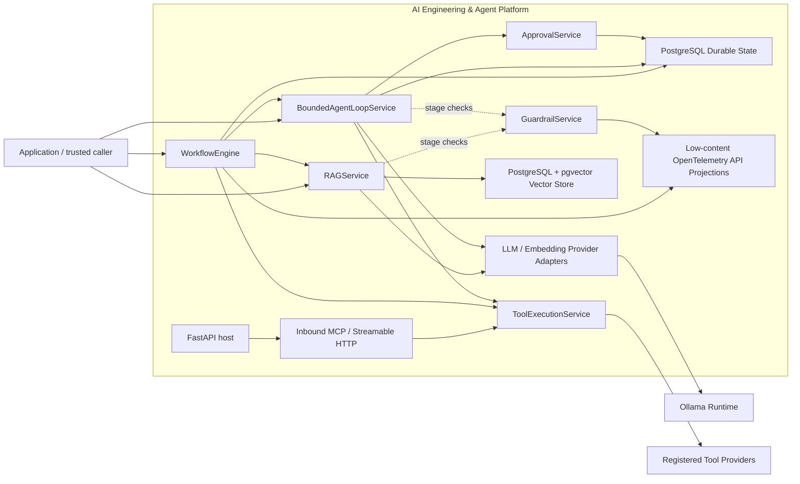

# AI Engineering & Agent Platform

A self-hosted AI engineering and agent platform built as a portfolio
project to demonstrate secure, observable, testable, and maintainable AI
platform engineering practices.

**Core technologies:** Python 3.13 · FastAPI · PostgreSQL 18 · pgvector ·
Psycopg · Alembic · Ollama · MCP Python SDK · OpenTelemetry API ·
Docker Compose · GitHub Actions · uv · Ruff · mypy · pytest · Gitleaks ·
CycloneDX

## Status

Portfolio release baseline complete for the current scoped implementation.

The repository remains intentionally incremental. Capabilities under `Planned Capabilities` are future work and should not be interpreted as implemented or production-ready.

The repository currently includes:

- repository governance, security, architecture, and engineering standards;
- a Python/FastAPI application foundation;
- liveness and readiness endpoints;
- provider-neutral contracts for language models, embeddings, rerankers,
  vector stores, and controlled tool execution;
- immutable provider-neutral request and response models;
- a domain-level provider exception hierarchy;
- concrete Ollama adapters implementing the language-model and embedding
  provider contracts;
- non-streaming Ollama chat request and response mapping;
- batch Ollama embedding request and response mapping through `/api/embed`;
- optional embedding-dimension requests with validated response dimensions;
- explicit `truncate=false` embedding requests to avoid silent input
  truncation;
- validated Ollama runtime configuration shared by LLM and embedding
  capabilities;
- shared HTTP-client construction with capability-specific provider runtime
  composition and explicit lifecycle ownership;
- normalized provider errors for timeout, transport, HTTP-status, malformed
  JSON, and malformed provider responses;
- isolated Ollama adapter tests using mocked HTTP transport;
- PostgreSQL 18 + pgvector 0.8.6 persistence through a pinned local
  development container image;
- Alembic-managed PostgreSQL schema migrations;
- separate bootstrap/migration and least-privilege application database
  identities;
- a Psycopg async connection-pool runtime with explicit lifecycle ownership;
- a concrete `PostgreSQLVectorStoreProvider` implementing vector upsert,
  exact L2 nearest-neighbor query, and scoped delete operations;
- provider-neutral higher-is-better vector scores, with PostgreSQL L2
  distance normalized as `1 / (1 + distance)`;
- ordered vector metadata persisted as JSONB;
- reproducible PostgreSQL/pgvector integration validation using an isolated,
  ephemeral Docker Compose project;
- deterministic character-window chunking with exact source offsets and
  preserved document provenance;
- bounded caller-supplied knowledge-source ingestion for UTF-8 `text/plain`
  and `text/markdown` payloads;
- explicit source-size, media-type, UTF-8, NUL, and chunk-provenance
  validation before indexing;
- no filesystem or network source acquisition in the current ingestion
  foundation;
- provider-neutral indexing orchestration from validated chunks through the
  embedding provider into the vector-store provider;
- provider-neutral semantic retrieval orchestration from query embedding
  through vector search into validated evidence;
- strict reconstruction of retrieval provenance, source metadata, text, rank,
  score, and citation-ready source offsets;
- optional provider-neutral reranking orchestration that preserves the
  original vector score and rank separately from reranker score and rank;
- deterministic grounded-context assembly over validated retrieval or reranked
  evidence;
- provider-neutral grounded generation through the existing `LLMProvider`
  contract;
- fail-closed grounded-generation validation for model identity, completion
  reason, citation grammar, and citation membership;
- canonical `C1`, `C2`, ... citation identifiers resolved only to evidence
  already present in the supplied retrieval result;
- explicit `INSUFFICIENT_EVIDENCE` abstention without fabricated provenance;
- provider-neutral end-to-end RAG orchestration through `RAGService`;
- deterministic retrieval -> optional reranking -> grounded-generation stage
  ordering;
- controlled no-evidence abstention without reranker or LLM execution;
- preservation of the original retrieval result and the exact grounding input
  used for generation through `RAGResult`;
- project-owned workflow execution with durable PostgreSQL checkpoints,
  explicit resume, durable authenticated approval state, and durable agent
  continuations;
- deterministic fail-closed runtime guardrails across user input, retrieved
  context, tool results, and model output, with adversarial evaluation and
  low-content OpenTelemetry API projections;
- automated architectural dependency checks;
- CI/CD and software supply-chain validation, including a dedicated
  PostgreSQL integration job.

Current model execution is available through provider runtime boundaries.
LLM generation uses Ollama's non-streaming `/api/chat` endpoint, while
embedding generation uses `/api/embed`. The FastAPI application does not yet
expose public model-generation, embedding, or retrieval endpoints.

The provider-neutral LLM contract now supports explicit tool definitions and
inert tool-call proposals. `LLMRequest.tools` exposes unique
`ToolDefinition` values to a provider, while `LLMResponse.tool_calls`
contains immutable `LLMToolCall` proposals and uses
`FinishReason.TOOL_CALLS` when proposals are present. A proposal is
untrusted model output: it is not a `ToolInvocation`, does not carry platform
execution authority, and cannot execute a tool by itself.

## Golden Demo

The repository includes a deterministic golden demo for the current platform
baseline:

    ./scripts/demo/run-golden-demo.sh

The demo exercises grounded retrieval with platform-owned citation provenance
and deterministic runtime guardrails, then invokes the isolated live
PostgreSQL integration gate covering durable workflow state, authenticated
human-in-the-loop approval, durable agent continuations, controlled tool
execution, restart/resume, and replay boundaries.

Deterministic synthetic AI providers are used for the portfolio-facing RAG and
guardrail stages so platform behavior can be demonstrated without depending on
model randomness or downloaded model weights. The repository's real Ollama
adapters remain independently available and tested.

See [Golden Demo](examples/README.md) for requirements, demonstrated security
boundaries, and explicit non-claims.

## Controlled Tool Execution Foundation

The platform now includes a provider-neutral controlled tool execution
foundation built on the existing `ToolProvider`, `ToolDefinition`,
`ToolInvocation`, and `ToolResult` contracts.

`ToolRegistry` requires globally unique tool identities and explicit policy
coverage for every registered tool. `ToolExecutionService` then enforces:

- an explicit per-execution tool allowlist;
- enabled/disabled platform policy;
- structural approval evidence when policy requires it;
- exact `call_id` plus `tool_name` approval binding;
- strict required/unexpected argument validation;
- portable scalar argument type validation without coercion;
- exact result-to-invocation identity validation;
- provider failure propagation without implicit retries.

`ToolApprovalGrant` remains structural approval evidence at the execution
boundary rather than a human-identity object. Durable authenticated HITL is
implemented separately through `ApprovalService` and persisted approval-request
state; successful approval yields structurally bound evidence that
`ToolExecutionService` validates without transferring approval authority to the
model or provider adapter.

The provider adapter still produces inert `LLMToolCall` values and never
executes tools by itself. A separate `ControlledAgentService` may now expose
only registered, enabled, explicitly authorized tools to an LLM and convert
accepted proposals into controlled `ToolInvocation` values. Execution IDs are
created by the platform with a fresh UUID4-backed nonce by default;
`provider_call_id` remains untrusted metadata and never becomes execution
authority.

Before the first provider side effect, every planned invocation is checked
through the side-effect-free `ToolExecutionService.validate()` boundary. A
missing structural approval produces an `APPROVAL_REQUIRED` result instead of
executing the batch. Resume accepts only a validated active continuation bound
to the frozen plan. Project-owned persistence can retain active and consumed
continuation state across process loss, while replay and identity checks occur
before resumed provider execution without re-running the LLM decision.

The platform now also provides a bounded conversational agent loop through
`BoundedAgentLoopService`. The loop composes `ControlledAgentService` rather
than bypassing it, so every new model-proposed action still passes through the
existing registered/enabled/authorized tool exposure, fresh platform execution
identity, whole-plan preflight, approval, and result-identity boundaries.

Conversation history now has explicit provider-neutral
`LLMAssistantToolCallMessage` and `LLMToolResultMessage` values plus
`MessageRole.TOOL`. Tool-call/result ordering, tool-name correlation, and
provider call correlation are validated before a transcript can be sent back
to an LLM. Ollama receives the provider-facing tool result, while the internal
platform execution `call_id` is deliberately not serialized into the Ollama
wire payload. Tool output remains untrusted model context and never becomes
execution authority.

The conversational loop has independent global ceilings of
`MAX_AGENT_LOOP_MODEL_TURNS = 8` and `MAX_AGENT_LOOP_TOOL_CALLS = 8`.
Tool-call consumption accumulates across model turns instead of resetting on
each turn. Approval-required execution can pause and resume the exact frozen
decision without model regeneration. Active and consumed turn/loop
continuations can be persisted through the project-owned continuation store,
with replay and identity validation remaining fail-closed before resumed
provider execution.

The bounded loop remains sequential, non-transactional, and non-distributed.
Durable continuation persistence does not provide exactly-once external side
effects: earlier successful side effects are not rolled back if a later
execution fails, and automatic retry after execution begins remains absent.
Authenticated HITL is owned by the separate approval control plane, and
workflow orchestration is owned by the separate workflow service boundary. MCP
wire transports plus shell/filesystem/network tools remain outside the
bounded-agent service itself.

Persistent vector storage is now complemented by provider-neutral retrieval,
grounded generation, and end-to-end RAG orchestration. Deterministic chunking,
indexing, semantic retrieval, validated evidence reconstruction, optional
reranking, deterministic context assembly, grounded model generation, explicit
abstention, citation-to-evidence resolution, and retrieval-to-generation
composition are implemented and covered by tests.

`GroundedGenerationService` consumes an already validated `RetrievalResponse`
or `RerankedRetrievalResponse`; it does not own retrieval execution. Model
citation markers such as `[[C1]]` are resolved by the platform back to the
retrieved evidence object, so the model does not author source references,
document identifiers, offsets, or other provenance metadata.

`RAGService` composes `RetrievalService`, optional `RerankingService`, and
`GroundedGenerationService` without moving provider ownership into the
orchestration layer. Empty retrieval is handled as a controlled abstention
before reranking or LLM execution. `RAGResult` preserves both the original
retrieval output and the exact retrieval or reranked evidence supplied to
grounded generation.

This establishes citation integrity and provenance binding, not automatic
semantic entailment or factual verification of every generated claim.

The current evaluation foundation adds versioned, provenance-aware RAG
evaluation datasets and deterministic execution through
`RAGEvaluationService`. It measures retrieval, final grounding-input, and
citation precision/recall against explicit expected chunk identifiers, plus
answer-status accuracy. These are structural evidence-alignment metrics; they
do not establish semantic entailment, factual correctness, or model
truthfulness.
Retrieved evidence also remains untrusted data and may contain indirect prompt
injection content.

The repository now implements bounded caller-supplied text ingestion,
controlled tool execution, inert LLM tool-call proposals, bounded single-turn
agent orchestration, typed tool-result conversation history, a bounded
multi-turn conversational agent loop, project-owned workflow execution with
durable checkpoints/resume, durable authenticated HITL, durable agent
continuations, and deterministic stage-aware runtime guardrails. It still does
not implement filesystem or network source loaders, PDF/DOCX/HTML parsing,
document replacement/reindex lifecycle orchestration, a public retrieval API,
a concrete reranker adapter, tenant-aware retrieval authorization,
presentation-layer citation rendering, semantic groundedness evaluation,
outbound remote MCP wire transport, MCP stdio/resources/prompts,
production identity-provider integration, durable/distributed agent execution,
or centralized AI observability backends.

## MCP Interoperability Foundation

The repository now has both a transport-neutral MCP core and an authenticated
server-side Streamable HTTP adapter.

Remote MCP consumption remains transport-neutral. `MCPClient`,
`MCPTrustPolicy`, and explicit `MCPToolBinding` values keep discovery
non-authoritative: discovered remote tools do not automatically become
registered, trusted, authorized, or model-visible. Platform-owned local
`ToolDefinition` values continue to own the local name, description, and
parameter schema.

For project-owned tool exposure, `OwnedMCPToolService` remains the execution
control boundary beneath the wire adapter. It exposes only explicitly selected,
enabled, authorized tools that do not require approval and delegates execution
through `ToolExecutionService`. External MCP request IDs remain correlation
data rather than platform execution identities.

Feature 16 adds a concrete inbound MCP server path using the official Python
MCP SDK pinned as `mcp==2.2.0`. The implemented and tested protocol path uses
MCP revision `2026-07-28`, Streamable HTTP, JSON responses, and stateless HTTP.
The FastAPI host mounts the MCP ASGI application while owning the SDK
`session_manager` lifecycle. The server publishes `/mcp` and the protected
resource metadata route required by the SDK.

Bearer-token verification is supplied through an injected `TokenVerifier`.
The SDK resource-server middleware is configured with resource validation and
required transport scopes. After token verification, `MCPAccessPolicy` derives
local `ToolExecutionAuthorization` only from platform-owned mappings of verified
token scopes to tool names. Arbitrary token claims such as an
`allowed_tool_names` claim do not grant capabilities, and the wire layer never
constructs approval grants.

The concrete HTTP path currently supports and tests `tools/list` and
`tools/call`. Approval-required tools remain excluded. Scalar tool arguments
remain fail-closed and are not silently coerced into platform values.

MCP is disabled by default. Runtime configuration includes:

- `AI_PLATFORM_MCP_ENABLED`;
- `AI_PLATFORM_MCP_HOST`;
- `AI_PLATFORM_MCP_ISSUER_URL`;
- `AI_PLATFORM_MCP_RESOURCE_SERVER_URL`;
- `AI_PLATFORM_MCP_REQUIRED_SCOPES`;
- `AI_PLATFORM_MCP_MAX_REQUEST_BODY_SIZE`.

When MCP is enabled, issuer and resource URLs are required, the resource URL
must target `/mcp`, and production issuer/resource URLs must use HTTPS.
Non-local MCP hostnames require explicit transport-security configuration
instead of silently accepting unrestricted Host/Origin values.

This feature does not ship a concrete production identity-provider integration
or a production `TokenVerifier`; deployments must inject one. It also does not
add stdio transport, an outbound remote MCP wire client, MCP resources or
prompts, durable authenticated HITL approval, transport rate limiting,
transport execution timeouts, or shell/filesystem/network tools. TLS
termination is not implemented by the application itself. Remote MCP results
and protocol input remain untrusted data.

## Project-Owned Workflow Execution Engine

Feature 17 adds a project-owned workflow and execution engine without an
external workflow-engine dependency.

Implemented capabilities include:

- immutable static workflow DAGs with explicit dependencies;
- deterministic sequential execution and a hard 32-step definition ceiling;
- typed `STRING`, `INTEGER`, `FLOAT`, and `BOOLEAN` run inputs;
- deterministic `EQUALS` and `NOT_EQUALS` conditions without arbitrary
  expression execution;
- explicit `COMPLETED`, `SKIPPED`, and `FAILED` step state;
- terminal `COMPLETED` and `FAILED` run state;
- controlled adapters over `ToolExecutionService`, `RAGService`, and
  `BoundedAgentLoopService`;
- workflow-owned tool call IDs and fail-closed approval behavior;
- no automatic retry and no rollback;
- privacy-safe structured workflow execution events and terminal traces;
- allowlisted operational observability metadata;
- an injected OpenTelemetry API adapter using
  `opentelemetry-api==1.45.0`.

Workflow events intentionally exclude input values, prompts, tool arguments,
RAG content, executor outputs, and exception text.

The OpenTelemetry integration is an API-level terminal trace projection only.
It does not configure the OpenTelemetry SDK, OTLP exporters, a Collector, a
telemetry backend, or execution-duration measurement.

Current limitations are explicit: workflow execution remains caller-driven and
sequential. Durable checkpoint persistence/resume and authenticated HITL are
implemented, but there is no automatic retry, rollback, parallel scheduling,
arbitrary expression language, or exactly-once guarantee for external side
effects across process loss.

## Planned Capabilities

The platform is intended to evolve incrementally toward capabilities
including:

- additional local and remote model adapters;
- streaming and richer model-capability handling;
- additional embedding-provider adapters;
- additional knowledge-source loaders and richer document parsing (for example PDF, DOCX, and HTML);
- public retrieval API exposure;
- concrete local or remote reranker adapters;
- production database hardening, backup/recovery, and availability patterns;
- tenant-aware retrieval authorization and data lifecycle controls;
- presentation-layer citation rendering and automated semantic
  groundedness/citation-quality evaluation;
- durable/distributed conversational-agent execution and continuation recovery;
- cross-process agent state, durable replay protection, and resumable
  continuation recovery;
- outbound remote MCP wire-client support, stdio transport, MCP resources/prompts, and production identity-provider integration;
- broader semantic/adaptive guardrails and policy coverage beyond the current
  deterministic literal-pattern foundation;
- richer external evaluation datasets, semantic entailment/factual correctness evaluators, and optional judge-based evaluation;
- AI and application observability;
- centralized OpenTelemetry SDK/exporter/Collector/backend integration;
- metrics and dashboards;
- an AI Developer Console.

Capabilities listed here describe project direction and are not considered
implemented until corresponding code, tests, documentation, and validation
are merged.

## Local Development

The project currently targets Python 3.13.15 and uses `uv` for dependency
and environment management.

Synchronize the environment:

    uv sync

Run the API locally:

    uv run uvicorn ai_engineering_agent_platform.app:app --host 127.0.0.1 --port 8000

Current system endpoints:

- `GET /health` - liveness;
- `GET /ready` - readiness.

Run local validation:

    uv run pytest
    uv run ruff format --check src tests
    uv run ruff check src tests
    uv run mypy src tests

### Local Ollama Runtime

Ollama is the first concrete model-runtime integration and currently backs
both LLM generation and embedding execution. Ollama itself and model weights
are not distributed by this repository.

Runtime configuration uses:

- `AI_PLATFORM_OLLAMA_BASE_URL`, defaulting to
  `http://127.0.0.1:11434`;
- `AI_PLATFORM_OLLAMA_REQUEST_TIMEOUT_SECONDS`, defaulting to `120`.

The configured base URL must be an absolute HTTP or HTTPS origin without
embedded credentials, path components, query parameters, or fragments.

The current LLM adapter supports non-streaming chat generation. The
embedding adapter supports batch `/api/embed` requests, optional requested
dimensions, response-shape validation, and explicit `truncate=false`
behavior.

A shared Ollama HTTP-client factory consumes the validated runtime settings.
Capability-specific runtimes own client cleanup, while
`OllamaLLMProvider` and `OllamaEmbeddingProvider` remain independent of
HTTP-client lifecycle management.

For opt-in real-runtime validation procedures, see
[Local Ollama Smoke Tests](docs/operations/local-ollama-smoke-test.md).

### PostgreSQL + pgvector Persistence

PostgreSQL persistence is implemented behind the provider-neutral
`VectorStoreProvider` contract. The concrete adapter uses pgvector for exact
L2 nearest-neighbor search while keeping PostgreSQL-specific behavior outside
the contract layer.

The local persistence foundation includes:

- PostgreSQL 18 with pgvector 0.8.6;
- an image pinned by digest in `compose.yaml`;
- loopback-only host-port publishing by default;
- SCRAM authentication;
- an `ai_platform_admin` bootstrap/migration identity;
- a separate `ai_platform_runtime` application identity;
- least-privilege grants for the runtime role;
- Alembic migrations;
- external database credentials rather than committed secrets;
- an async Psycopg pool owned by runtime composition;
- exact vector search without HNSW or IVFFlat indexes at this stage;
- explicit provider-neutral `space_id` on vector upsert, query, and delete;
- PostgreSQL collection identity scoped by `(namespace, space_id)`;
- fail-closed embedding-response model validation before indexing or retrieval
  reaches vector persistence.

`namespace` remains the logical data partition. `space_id` independently
identifies the vector/embedding space. Indexing and retrieval default that
identity to the configured embedding model, while callers may provide a
stricter identity when they control model revision or artifact provenance.

The repository does not currently verify or pin an embedding-model revision or
digest through `space_id`; providing such a stronger identifier remains the
caller's responsibility.

For local setup, migrations, credentials, operational boundaries, and
integration validation, see
[PostgreSQL + pgvector Operations](docs/operations/postgres-vector-store.md).

## Continuous Integration

GitHub Actions validates pull requests and pushes to `main`.

The current CI baseline includes:

- GitHub Actions workflow linting;
- locked Python environment synchronization;
- formatting;
- linting;
- strict static type checking;
- automated tests with warnings treated as errors;
- package build validation;
- isolated PostgreSQL + pgvector provisioning, migration, and live
  vector-provider integration;
- Git history and working-tree secret scanning;
- dependency vulnerability auditing;
- dependency-license inventory;
- CycloneDX SBOM generation and validation.

Supply-chain reports are generated during CI and retained as workflow
artifacts for a limited period.

## Architecture

The diagram below summarizes implemented application and persistence boundaries
in the current portfolio release. It is a logical architecture view rather
than a production deployment topology and does not imply that every application
service is exposed through a public HTTP API.

The model/provider boundary never becomes an authorization boundary:
model-proposed tool calls remain inert until platform controls accept them.
`ToolExecutionService` remains the final controlled execution authority, while
`ApprovalService` owns durable approval decisions. Retrieved content, tool
results, and model output remain untrusted data.

Architecture decisions and supporting documentation are maintained under:

- `docs/adr/`
- `docs/architecture/`
- `docs/security/`
- `docs/ai-safety/`
- `docs/operations/`

## Engineering Standards

Development and feature completion standards are documented in:

- [Development Standards](docs/operations/development-standards.md)
- [Definition of Done](docs/operations/definition-of-done.md)
- [AI Safety Principles](docs/ai-safety/ai-safety-principles.md)

## Security

Security is treated as a first-class design requirement.

See:

- [SECURITY.md](SECURITY.md)
- [Threat Model](docs/security/threat-model.md)

## Third-Party Components

Third-party software, services, models, datasets, specifications, tools,
and trademarks remain subject to their respective licenses and terms.

See [THIRD_PARTY_NOTICES.md](THIRD_PARTY_NOTICES.md).

## License

Repository-specific material is provided for portfolio, demonstration,
and evaluation purposes.

Copyright (c) 2026 Jesus Lopez.

All Rights Reserved.

See [LICENSE](LICENSE).
